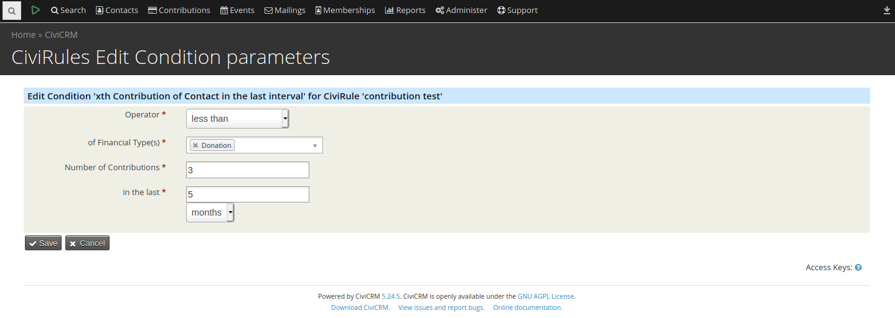

# hu.es-progress.civirules-addon



This extension adds a new trigger condition for CiviRules.
The condition is `xth Contribution of Contact in last interval` where the last interval is selectable (amount of days, months or years).

The extension is licensed under [AGPL-3.0](LICENSE.txt).

## Requirements

* PHP v7.0+
* CiviCRM (5.24) might work below - not tested
* CiviRules (2.16) might work below - not tested

## Installation (Web UI)

This extension has not yet been published for installation via the web UI.

## Installation (CLI, Zip)

Sysadmins and developers may download the `.zip` file for this extension and
install it with the command-line tool [cv](https://github.com/civicrm/cv).

```bash
cd <extension-dir>
cv dl hu.es-progress.civirules-addon@https://github.com/semseysandor/hu.es-progress.civirules-addon/archive/master.zip
```

## Installation (CLI, Git)

Sysadmins and developers may clone the [Git](https://en.wikipedia.org/wiki/Git) repo for this extension and
install it with the command-line tool [cv](https://github.com/civicrm/cv).

```bash
git clone https://github.com/semseysandor/hu.es-progress.civirules-addon.git
cv en civirules_addon
```

## Usage

When creating or updating a CiviRule there will be a new condition.
